# Web Component Inspector — Feature Flow Diagrams

> Companion to [`Feature-Architecture-Guide.md`](./Feature-Architecture-Guide.md). Every diagram reflects the system **as implemented** in `packages/ext-web-component-inspector`. Dormant/planned paths are labeled.
>
> **Legend (tiers):** `Agent` = injected browser agent (`dist/agent.js`) · `Host` = VS Code extension host (`dist/extension.js`) · `UI` = DevTools React page (`dist/devtools.js`) · `VSCode` = native VS Code surfaces.
>
> **Rendering note:** These are Mermaid diagrams. They render automatically on GitHub and in any Markdown preview with Mermaid support (e.g. the *Markdown Preview Mermaid Support* VS Code/Cursor extension). If you see raw code, your previewer lacks a Mermaid plugin.

## Infographic View (High-Level Visuals)

If Mermaid blocks appear as raw text in your editor, use these static infographic diagrams (SVG) instead:

1. **System Architecture Overview**

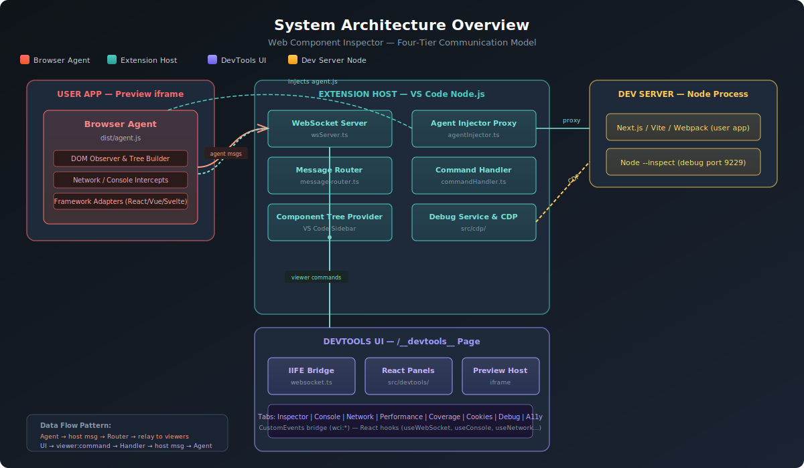

2. **Startup and Agent Injection**

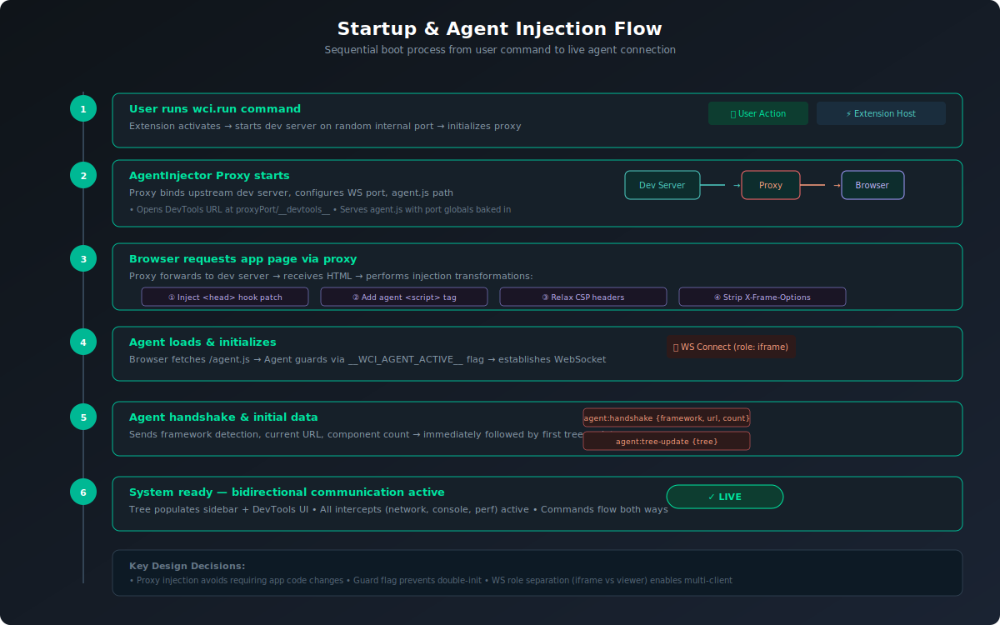

3. **Generic Command + Event Paths**

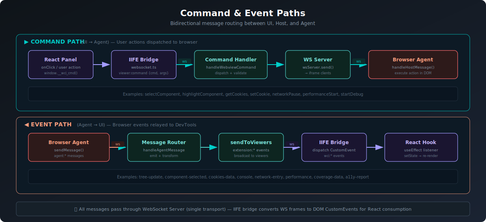

4. **Inspector Tree, Selection Sync, and Live Prop Editing**

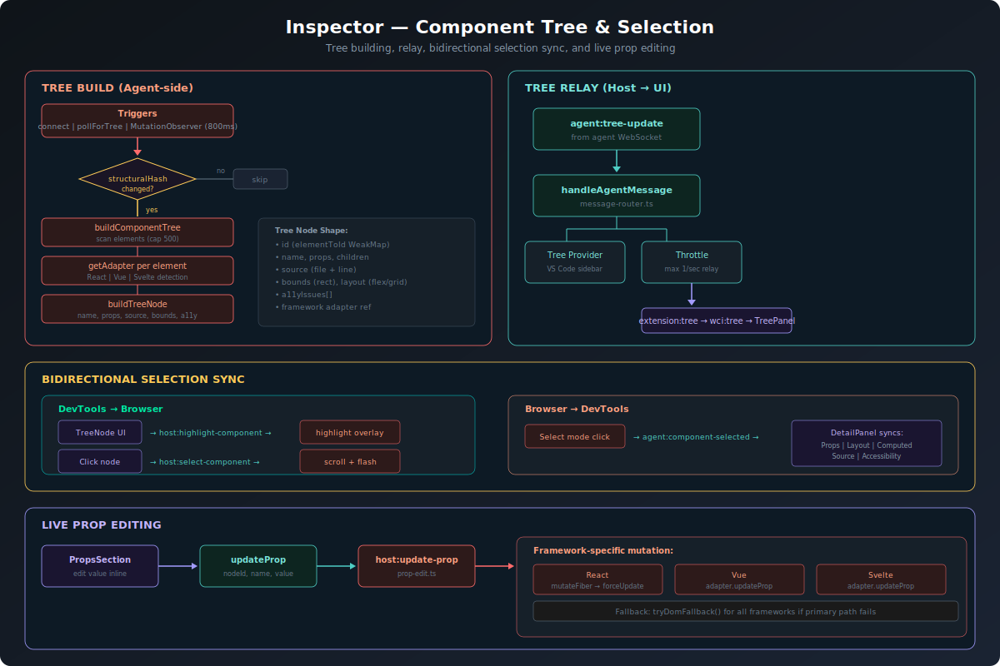

5. **Cookies CRUD**

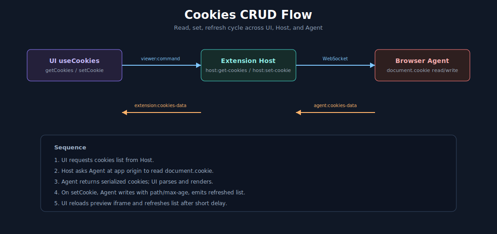

6. **Console Log Aggregation**

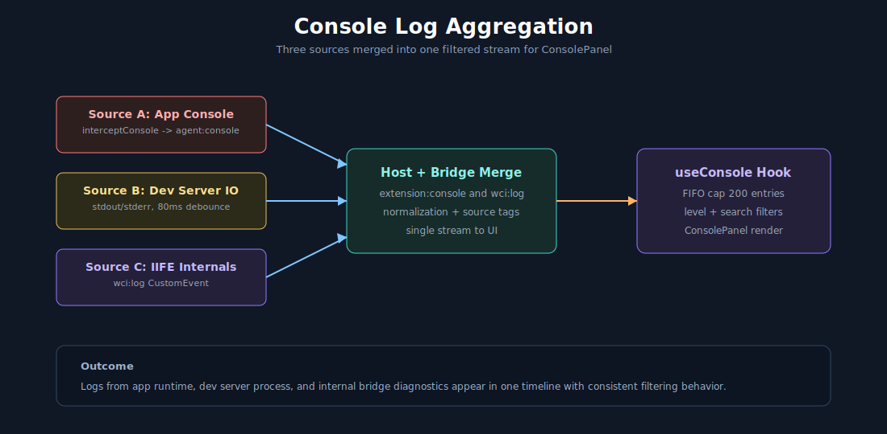

7. **Network Interception**

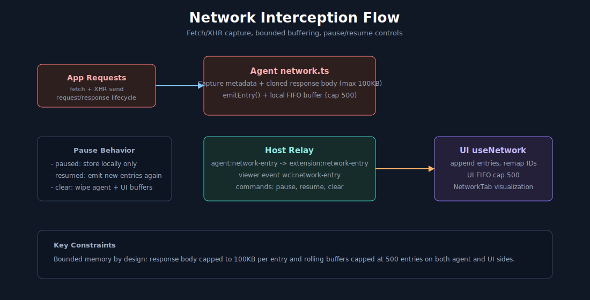

8. **Performance Render Tracking**

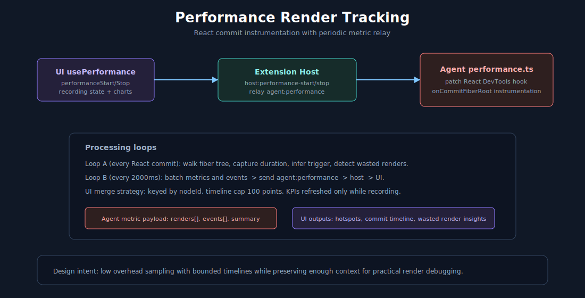

9. **Code Coverage Load and Run**

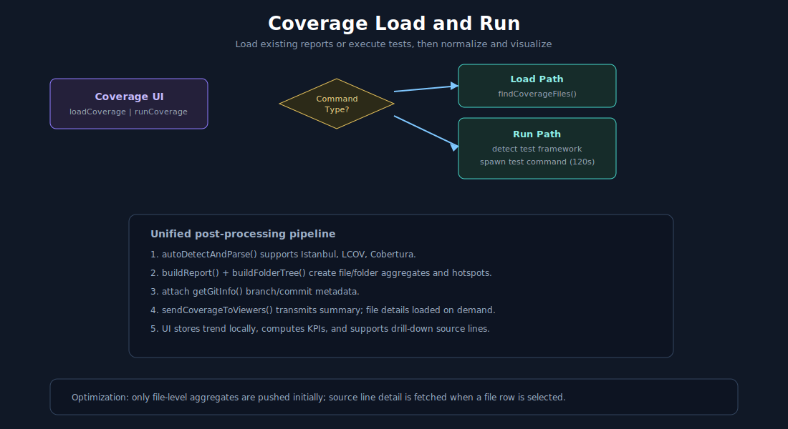

10. **Code Coverage: Git Branch Switch**

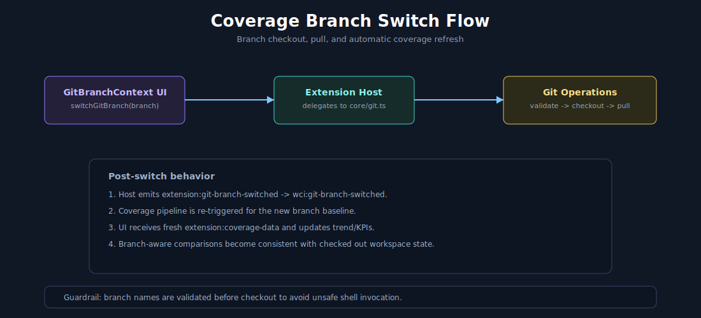

11. **Debug: Node Inspector Attach and Breakpoints**

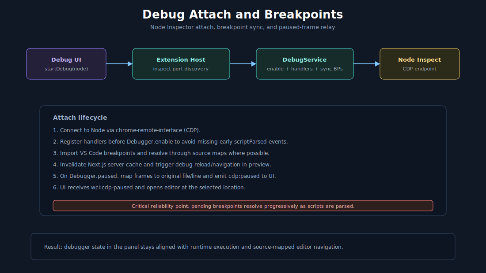

12. **Debug: Breakpoint Resolution State Machine**

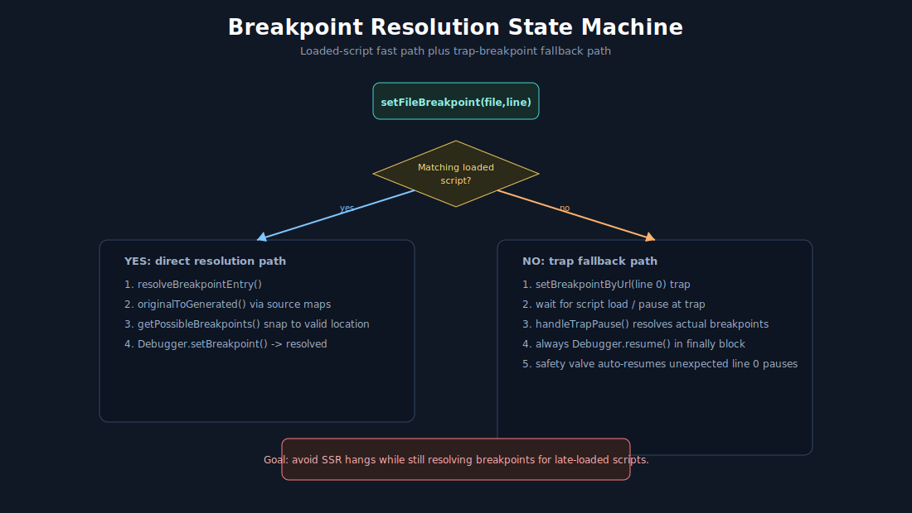

13. **Preview Navigation and Device Mode**

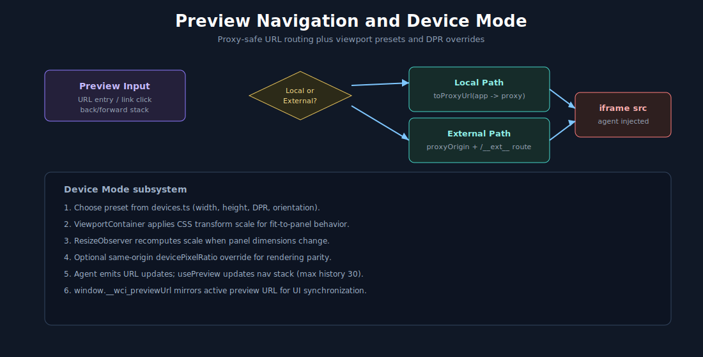

14. **Accessibility Audit and Problems Panel**

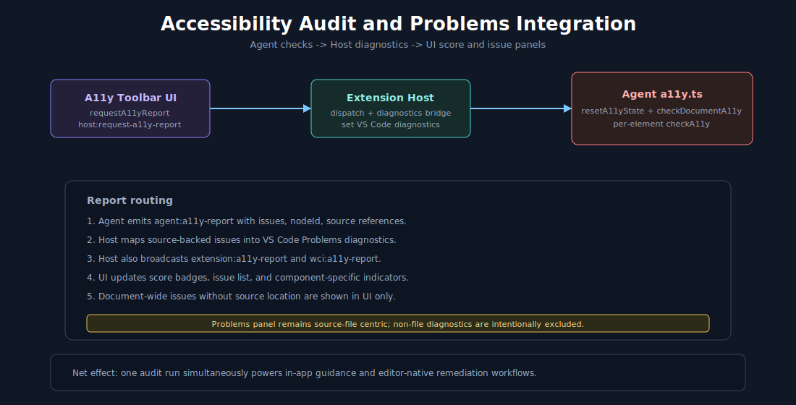

15. **Settings and Theme Bridge**

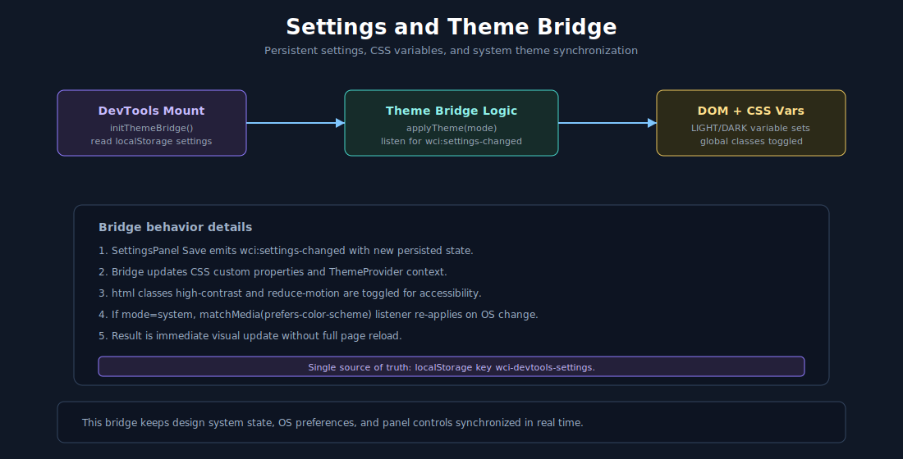

## Index

1. [System architecture overview](#1-system-architecture-overview)
2. [Startup and agent injection](#2-startup-and-agent-injection)
3. [Generic command path (UI to Agent)](#3-generic-command-path-ui-to-agent)
4. [Generic event path (Agent to UI)](#4-generic-event-path-agent-to-ui)
5. [Inspector: component tree build and relay](#5-inspector-component-tree-build-and-relay)
6. [Inspector: bidirectional selection sync](#6-inspector-bidirectional-selection-sync)
7. [Inspector: live prop editing](#7-inspector-live-prop-editing)
8. [Cookies CRUD](#8-cookies-crud)
9. [Console log aggregation](#9-console-log-aggregation)
10. [Network interception](#10-network-interception)
11. [Performance render tracking](#11-performance-render-tracking)
12. [Code coverage load and run](#12-code-coverage-load-and-run)
13. [Code coverage: git branch switch](#13-code-coverage-git-branch-switch)
14. [Debug: Node Inspector attach and breakpoints](#14-debug-node-inspector-attach-and-breakpoints)
15. [Debug: breakpoint resolution state machine](#15-debug-breakpoint-resolution-state-machine)
16. [Preview navigation and device mode](#16-preview-navigation-and-device-mode)
17. [Accessibility audit and Problems panel](#17-accessibility-audit-and-problems-panel)
18. [Settings and theme bridge](#18-settings-and-theme-bridge)

---

## 1. System architecture overview

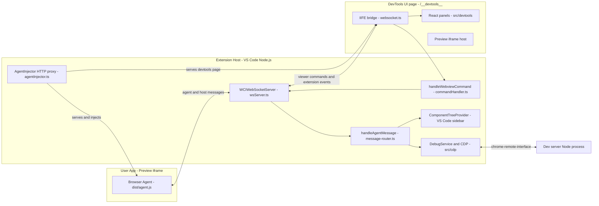
```mermaid
flowchart LR
  subgraph App["User App - Preview iframe"]
    Agent["Browser Agent - dist/agent.js"]
  end

  subgraph HostProc["Extension Host - VS Code Node.js"]
    WS["WCIWebSocketServer - wsServer.ts"]
    Proxy["AgentInjector HTTP proxy - agentInjector.ts"]
    Router["handleAgentMessage - message-router.ts"]
    Cmd["handleWebviewCommand - commandHandler.ts"]
    Tree["ComponentTreeProvider - VS Code sidebar"]
    CDP["DebugService and CDP - src/cdp"]
  end

  subgraph UIPage["DevTools UI page - /__devtools__"]
    IIFE["IIFE bridge - websocket.ts"]
    React["React panels - src/devtools"]
    Preview["Preview iframe host"]
  end

  NodeProc["Dev server Node process"]

  Agent <-->|"agent and host messages"| WS
  WS --> Router
  Router --> Tree
  WS <-->|"viewer commands and extension events"| IIFE
  IIFE --> React
  Cmd --> WS
  IIFE --> Cmd
  Proxy -->|"serves and injects"| Agent
  Proxy -->|"serves devtools page"| IIFE
  CDP <-->|"chrome-remote-interface"| NodeProc
  Router --> CDP
```

---

## 2. Startup and agent injection

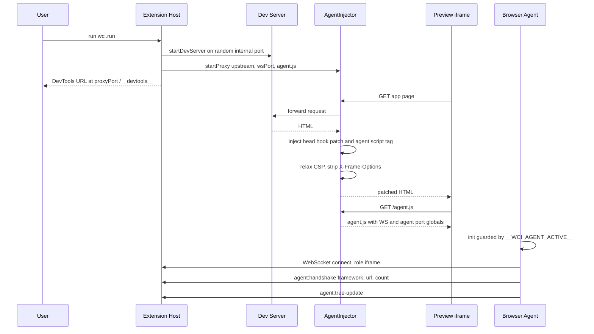
```mermaid
sequenceDiagram
  participant U as User
  participant Host as Extension Host
  participant Dev as Dev Server
  participant Proxy as AgentInjector
  participant Browser as Preview iframe
  participant Agent as Browser Agent

  U->>Host: run wci.run
  Host->>Dev: startDevServer on random internal port
  Host->>Proxy: startProxy upstream, wsPort, agent.js
  Host-->>U: DevTools URL at proxyPort /__devtools__
  Browser->>Proxy: GET app page
  Proxy->>Dev: forward request
  Dev-->>Proxy: HTML
  Proxy->>Proxy: inject head hook patch and agent script tag
  Proxy->>Proxy: relax CSP, strip X-Frame-Options
  Proxy-->>Browser: patched HTML
  Browser->>Proxy: GET /agent.js
  Proxy-->>Browser: agent.js with WS and agent port globals
  Agent->>Agent: init guarded by __WCI_AGENT_ACTIVE__
  Agent->>Host: WebSocket connect, role iframe
  Agent->>Host: agent:handshake framework, url, count
  Agent->>Host: agent:tree-update
```

---

## 3. Generic command path (UI to Agent)

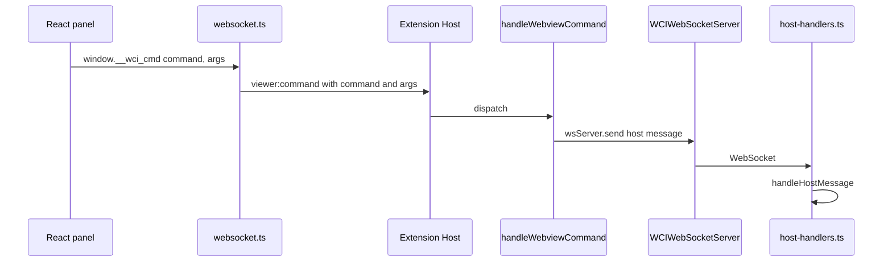
```mermaid
sequenceDiagram
  participant React as React panel
  participant IIFE as websocket.ts
  participant Host as Extension Host
  participant Cmd as handleWebviewCommand
  participant WS as WCIWebSocketServer
  participant Agent as host-handlers.ts

  React->>IIFE: window.__wci_cmd command, args
  IIFE->>Host: viewer:command with command and args
  Host->>Cmd: dispatch
  Cmd->>WS: wsServer.send host message
  WS->>Agent: WebSocket
  Agent->>Agent: handleHostMessage
```

---

## 4. Generic event path (Agent to UI)

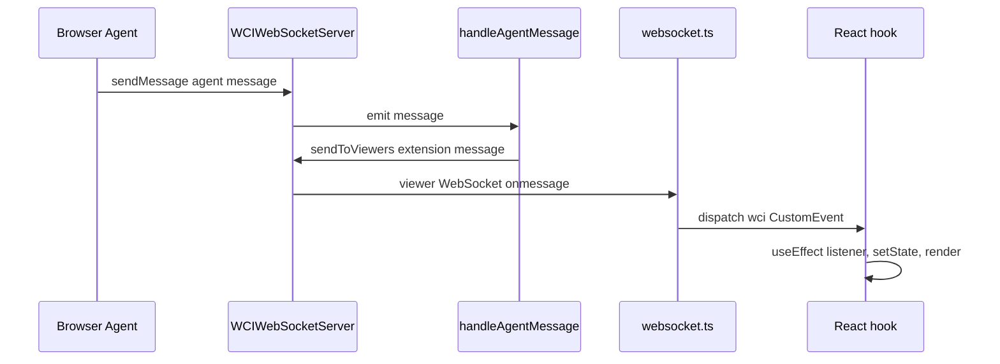
```mermaid
sequenceDiagram
  participant Agent as Browser Agent
  participant WS as WCIWebSocketServer
  participant Router as handleAgentMessage
  participant IIFE as websocket.ts
  participant React as React hook

  Agent->>WS: sendMessage agent message
  WS->>Router: emit message
  Router->>WS: sendToViewers extension message
  WS->>IIFE: viewer WebSocket onmessage
  IIFE->>React: dispatch wci CustomEvent
  React->>React: useEffect listener, setState, render
```

---

## 5. Inspector: component tree build and relay

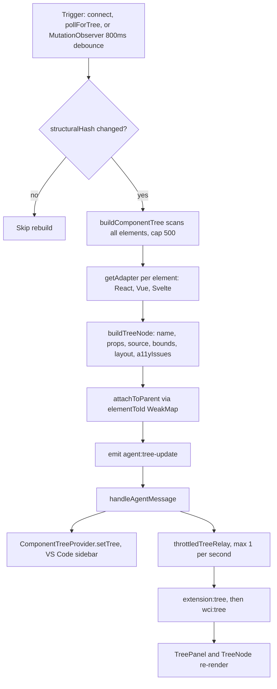
```mermaid
flowchart TD
  Trigger["Trigger: connect, pollForTree, or MutationObserver 800ms debounce"] --> Hash{"structuralHash changed?"}
  Hash -- no --> Skip["Skip rebuild"]
  Hash -- yes --> Build["buildComponentTree scans all elements, cap 500"]
  Build --> Adapter["getAdapter per element: React, Vue, Svelte"]
  Adapter --> Node["buildTreeNode: name, props, source, bounds, layout, a11yIssues"]
  Node --> Attach["attachToParent via elementToId WeakMap"]
  Attach --> Send["emit agent:tree-update"]
  Send --> RouterT["handleAgentMessage"]
  RouterT --> SB["ComponentTreeProvider.setTree, VS Code sidebar"]
  RouterT --> Thr["throttledTreeRelay, max 1 per second"]
  Thr --> Ext["extension:tree, then wci:tree"]
  Ext --> TP["TreePanel and TreeNode re-render"]
```

---

## 6. Inspector: bidirectional selection sync

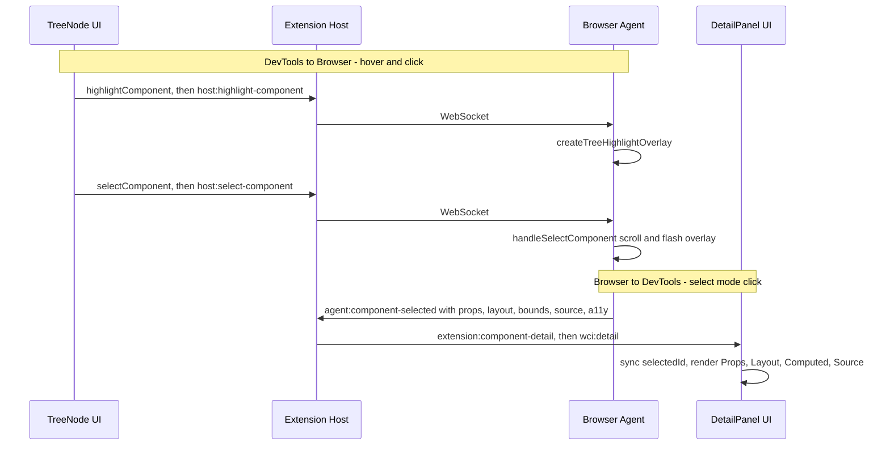
```mermaid
sequenceDiagram
  participant TreeUI as TreeNode UI
  participant Host as Extension Host
  participant Agent as Browser Agent
  participant Detail as DetailPanel UI

  Note over TreeUI,Agent: DevTools to Browser - hover and click
  TreeUI->>Host: highlightComponent, then host:highlight-component
  Host->>Agent: WebSocket
  Agent->>Agent: createTreeHighlightOverlay
  TreeUI->>Host: selectComponent, then host:select-component
  Host->>Agent: WebSocket
  Agent->>Agent: handleSelectComponent scroll and flash overlay

  Note over Agent,Detail: Browser to DevTools - select mode click
  Agent->>Host: agent:component-selected with props, layout, bounds, source, a11y
  Host->>Detail: extension:component-detail, then wci:detail
  Detail->>Detail: sync selectedId, render Props, Layout, Computed, Source
```

---

## 7. Inspector: live prop editing

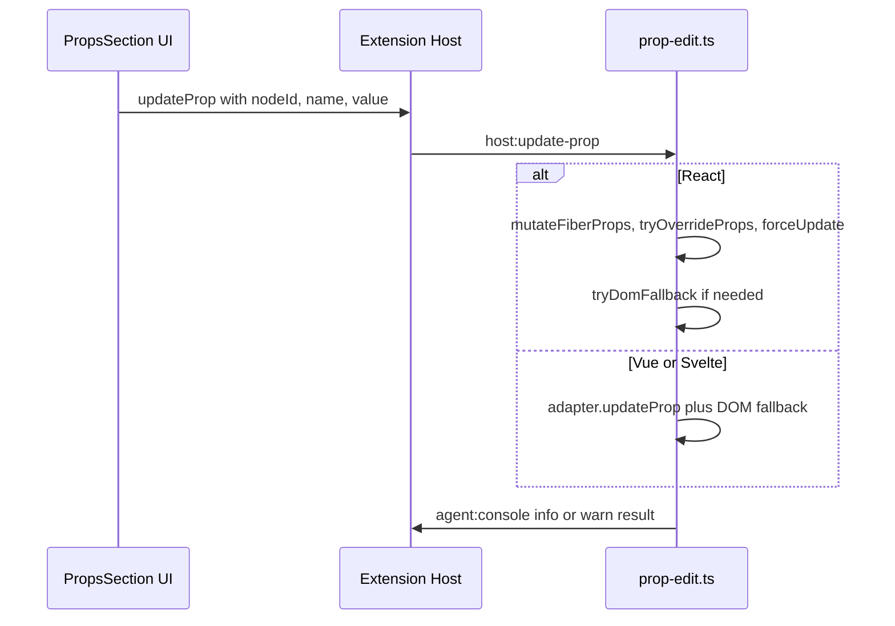
```mermaid
sequenceDiagram
  participant Props as PropsSection UI
  participant Host as Extension Host
  participant Agent as prop-edit.ts

  Props->>Host: updateProp with nodeId, name, value
  Host->>Agent: host:update-prop
  alt React
    Agent->>Agent: mutateFiberProps, tryOverrideProps, forceUpdate
    Agent->>Agent: tryDomFallback if needed
  else Vue or Svelte
    Agent->>Agent: adapter.updateProp plus DOM fallback
  end
  Agent->>Host: agent:console info or warn result
```

---

## 8. Cookies CRUD

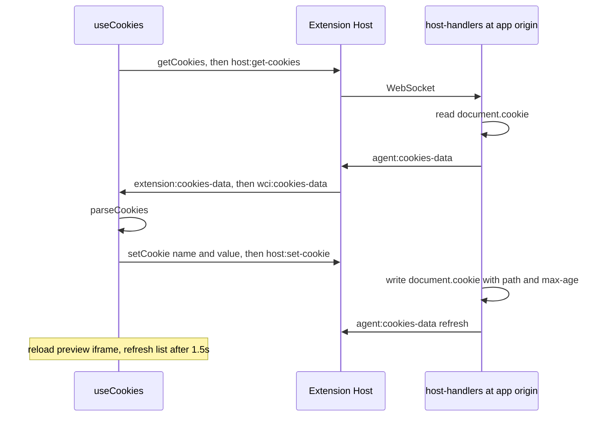
```mermaid
sequenceDiagram
  participant UI as useCookies
  participant Host as Extension Host
  participant Agent as host-handlers at app origin

  UI->>Host: getCookies, then host:get-cookies
  Host->>Agent: WebSocket
  Agent->>Agent: read document.cookie
  Agent->>Host: agent:cookies-data
  Host->>UI: extension:cookies-data, then wci:cookies-data
  UI->>UI: parseCookies

  UI->>Host: setCookie name and value, then host:set-cookie
  Agent->>Agent: write document.cookie with path and max-age
  Agent->>Host: agent:cookies-data refresh
  Note over UI: reload preview iframe, refresh list after 1.5s
```

---

## 9. Console log aggregation

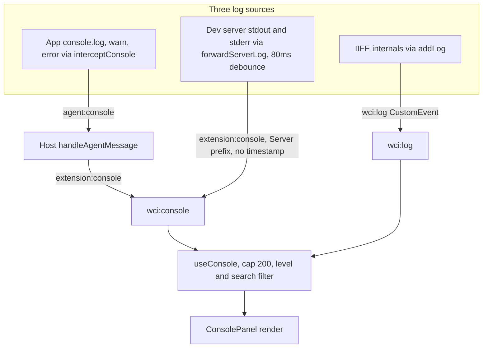
```mermaid
flowchart TD
  subgraph Sources["Three log sources"]
    A["App console.log, warn, error via interceptConsole"]
    B["Dev server stdout and stderr via forwardServerLog, 80ms debounce"]
    C["IIFE internals via addLog"]
  end
  A -->|"agent:console"| R["Host handleAgentMessage"]
  R -->|"extension:console"| W1["wci:console"]
  B -->|"extension:console, Server prefix, no timestamp"| W1
  C -->|"wci:log CustomEvent"| W2["wci:log"]
  W1 --> UC["useConsole, cap 200, level and search filter"]
  W2 --> UC
  UC --> CP["ConsolePanel render"]
```

---

## 10. Network interception

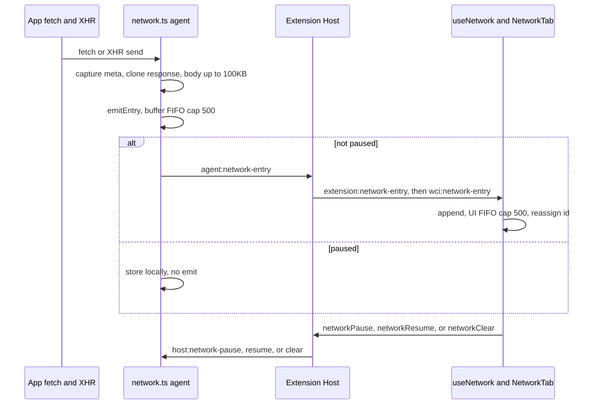
```mermaid
sequenceDiagram
  participant App as App fetch and XHR
  participant Net as network.ts agent
  participant Host as Extension Host
  participant UI as useNetwork and NetworkTab

  App->>Net: fetch or XHR send
  Net->>Net: capture meta, clone response, body up to 100KB
  Net->>Net: emitEntry, buffer FIFO cap 500
  alt not paused
    Net->>Host: agent:network-entry
    Host->>UI: extension:network-entry, then wci:network-entry
    UI->>UI: append, UI FIFO cap 500, reassign id
  else paused
    Net->>Net: store locally, no emit
  end
  UI->>Host: networkPause, networkResume, or networkClear
  Host->>Net: host:network-pause, resume, or clear
```

---

## 11. Performance render tracking

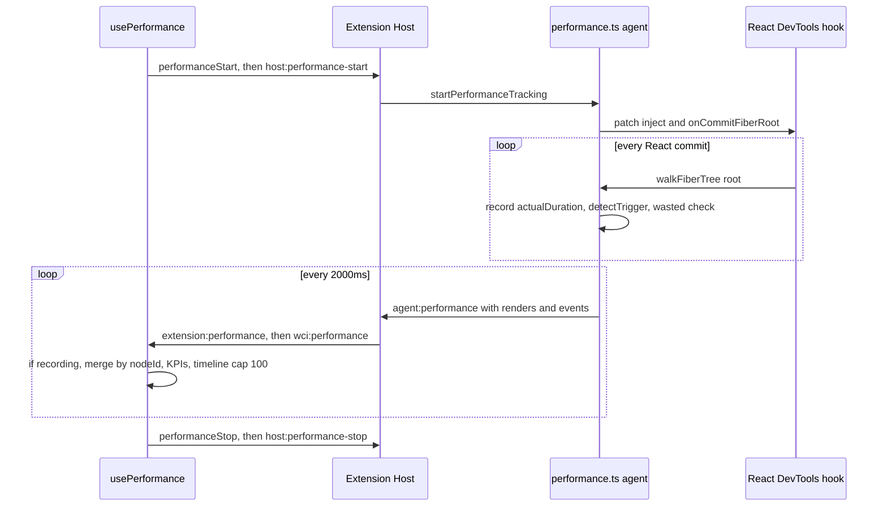
```mermaid
sequenceDiagram
  participant UI as usePerformance
  participant Host as Extension Host
  participant Perf as performance.ts agent
  participant Hook as React DevTools hook

  UI->>Host: performanceStart, then host:performance-start
  Host->>Perf: startPerformanceTracking
  Perf->>Hook: patch inject and onCommitFiberRoot
  loop every React commit
    Hook->>Perf: walkFiberTree root
    Perf->>Perf: record actualDuration, detectTrigger, wasted check
  end
  loop every 2000ms
    Perf->>Host: agent:performance with renders and events
    Host->>UI: extension:performance, then wci:performance
    UI->>UI: if recording, merge by nodeId, KPIs, timeline cap 100
  end
  UI->>Host: performanceStop, then host:performance-stop
```

---

## 12. Code coverage load and run

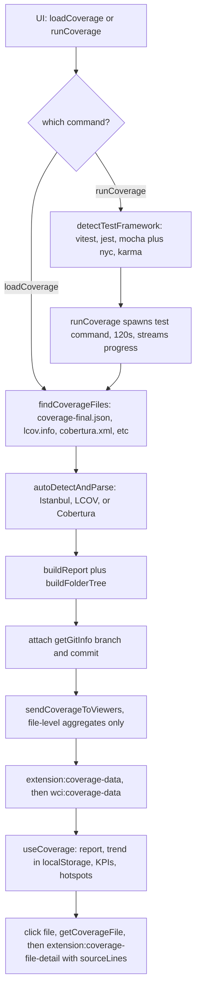
```mermaid
flowchart TD
  Load["UI: loadCoverage or runCoverage"] --> H{"which command?"}
  H -- loadCoverage --> Find["findCoverageFiles: coverage-final.json, lcov.info, cobertura.xml, etc"]
  H -- runCoverage --> Detect["detectTestFramework: vitest, jest, mocha plus nyc, karma"]
  Detect --> Spawn["runCoverage spawns test command, 120s, streams progress"]
  Spawn --> Find
  Find --> Parse["autoDetectAndParse: Istanbul, LCOV, or Cobertura"]
  Parse --> Report["buildReport plus buildFolderTree"]
  Report --> Git["attach getGitInfo branch and commit"]
  Git --> SendSum["sendCoverageToViewers, file-level aggregates only"]
  SendSum --> EvtD["extension:coverage-data, then wci:coverage-data"]
  EvtD --> UIstate["useCoverage: report, trend in localStorage, KPIs, hotspots"]
  UIstate --> Detail["click file, getCoverageFile, then extension:coverage-file-detail with sourceLines"]
```

---

## 13. Code coverage: git branch switch

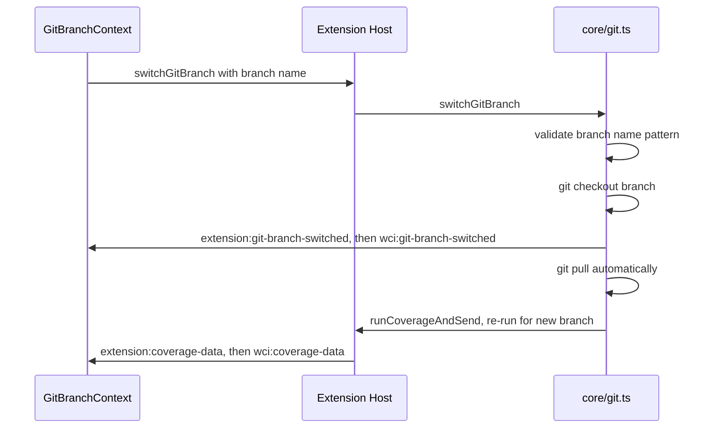
```mermaid
sequenceDiagram
  participant UI as GitBranchContext
  participant Host as Extension Host
  participant Git as core/git.ts

  UI->>Host: switchGitBranch with branch name
  Host->>Git: switchGitBranch
  Git->>Git: validate branch name pattern
  Git->>Git: git checkout branch
  Git->>UI: extension:git-branch-switched, then wci:git-branch-switched
  Git->>Git: git pull automatically
  Git->>Host: runCoverageAndSend, re-run for new branch
  Host->>UI: extension:coverage-data, then wci:coverage-data
```

---

## 14. Debug: Node Inspector attach and breakpoints

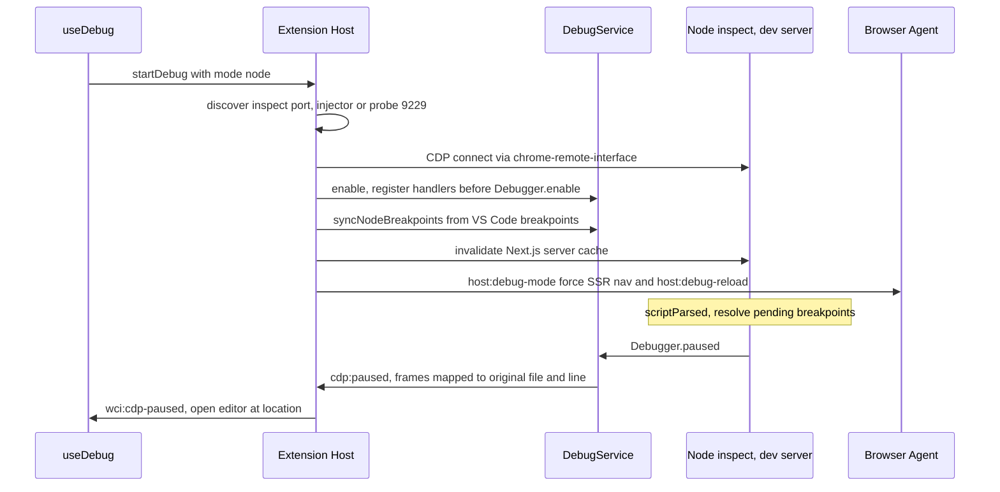
```mermaid
sequenceDiagram
  participant UI as useDebug
  participant Host as Extension Host
  participant DS as DebugService
  participant Node as Node inspect, dev server
  participant Agent as Browser Agent

  UI->>Host: startDebug with mode node
  Host->>Host: discover inspect port, injector or probe 9229
  Host->>Node: CDP connect via chrome-remote-interface
  Host->>DS: enable, register handlers before Debugger.enable
  Host->>DS: syncNodeBreakpoints from VS Code breakpoints
  Host->>Node: invalidate Next.js server cache
  Host->>Agent: host:debug-mode force SSR nav and host:debug-reload
  Note over Node: scriptParsed, resolve pending breakpoints
  Node->>DS: Debugger.paused
  DS->>Host: cdp:paused, frames mapped to original file and line
  Host->>UI: wci:cdp-paused, open editor at location
```

---

## 15. Debug: breakpoint resolution state machine

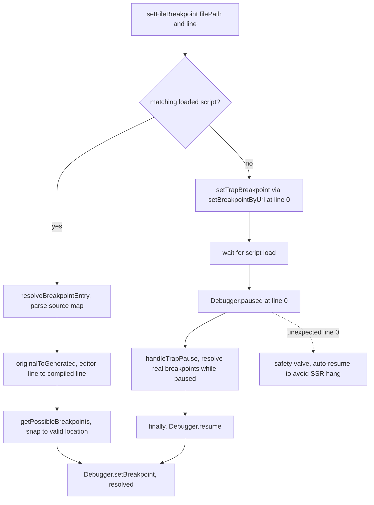
```mermaid
flowchart TD
  Set["setFileBreakpoint filePath and line"] --> Match{"matching loaded script?"}
  Match -- yes --> Resolve["resolveBreakpointEntry, parse source map"]
  Resolve --> Translate["originalToGenerated, editor line to compiled line"]
  Translate --> Snap["getPossibleBreakpoints, snap to valid location"]
  Snap --> SetCDP["Debugger.setBreakpoint, resolved"]
  Match -- no --> Trap["setTrapBreakpoint via setBreakpointByUrl at line 0"]
  Trap --> Wait["wait for script load"]
  Wait --> TrapPause["Debugger.paused at line 0"]
  TrapPause --> HandleTrap["handleTrapPause, resolve real breakpoints while paused"]
  HandleTrap --> Always["finally, Debugger.resume"]
  Always --> SetCDP
  TrapPause -. unexpected line 0 .-> SafetyValve["safety valve, auto-resume to avoid SSR hang"]
```

---

## 16. Preview navigation and device mode

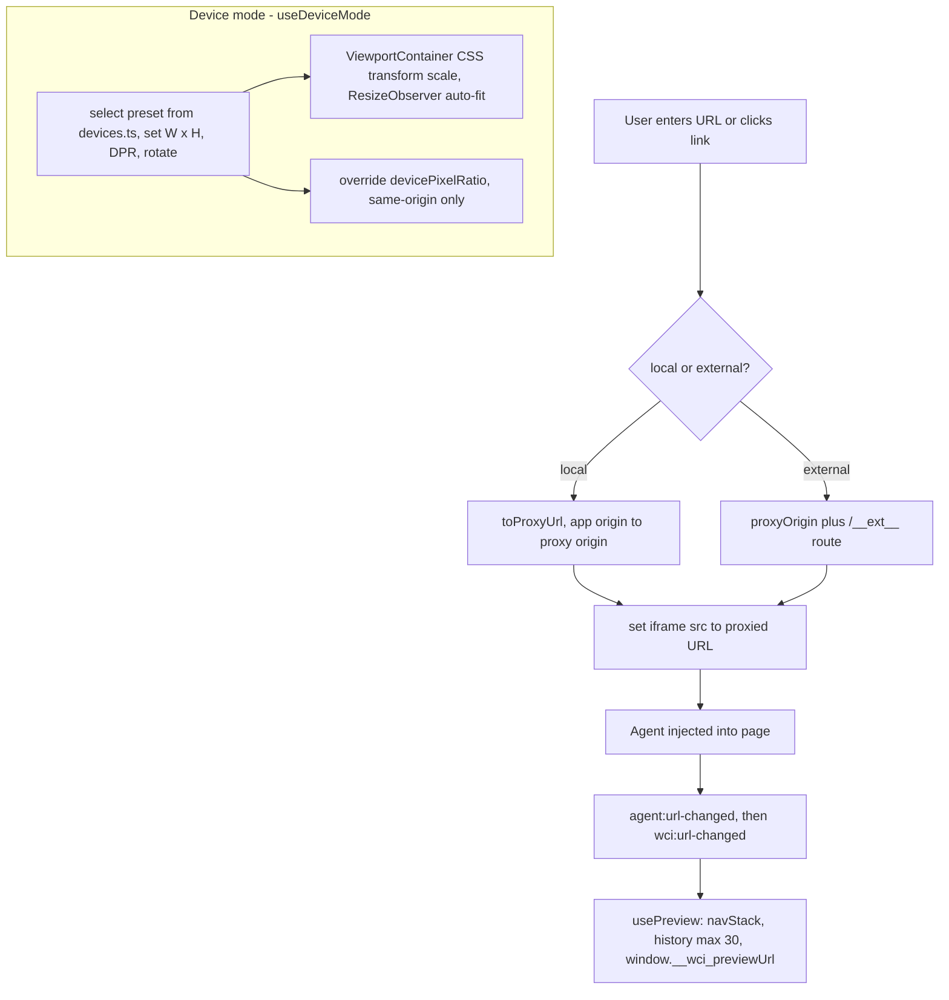
```mermaid
flowchart TD
  Input["User enters URL or clicks link"] --> Kind{"local or external?"}
  Kind -- local --> ToProxy["toProxyUrl, app origin to proxy origin"]
  Kind -- external --> Ext["proxyOrigin plus /__ext__ route"]
  ToProxy --> Src["set iframe src to proxied URL"]
  Ext --> Src
  Src --> Agent["Agent injected into page"]
  Agent --> UrlEvt["agent:url-changed, then wci:url-changed"]
  UrlEvt --> Stack["usePreview: navStack, history max 30, window.__wci_previewUrl"]

  subgraph DeviceMode["Device mode - useDeviceMode"]
    Preset["select preset from devices.ts, set W x H, DPR, rotate"]
    Preset --> Scale["ViewportContainer CSS transform scale, ResizeObserver auto-fit"]
    Preset --> DPR["override devicePixelRatio, same-origin only"]
  end
```

---

## 17. Accessibility audit and Problems panel

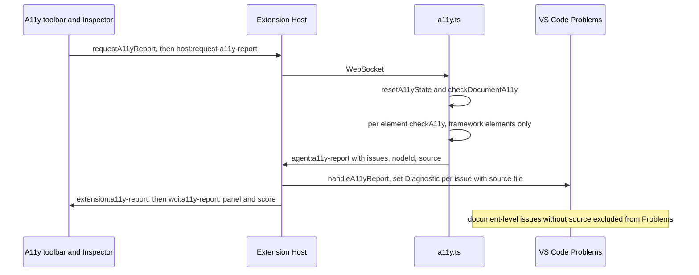
```mermaid
sequenceDiagram
  participant UI as A11y toolbar and Inspector
  participant Host as Extension Host
  participant Agent as a11y.ts
  participant VS as VS Code Problems

  UI->>Host: requestA11yReport, then host:request-a11y-report
  Host->>Agent: WebSocket
  Agent->>Agent: resetA11yState and checkDocumentA11y
  Agent->>Agent: per element checkA11y, framework elements only
  Agent->>Host: agent:a11y-report with issues, nodeId, source
  Host->>VS: handleA11yReport, set Diagnostic per issue with source file
  Host->>UI: extension:a11y-report, then wci:a11y-report, panel and score
  Note over VS: document-level issues without source excluded from Problems
```

---

## 18. Settings and theme bridge

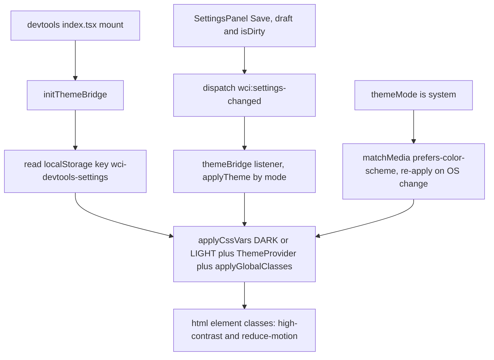
```mermaid
flowchart TD
  Mount["devtools index.tsx mount"] --> Init["initThemeBridge"]
  Init --> LS["read localStorage key wci-devtools-settings"]
  LS --> Apply["applyCssVars DARK or LIGHT plus ThemeProvider plus applyGlobalClasses"]
  Save["SettingsPanel Save, draft and isDirty"] --> Evt["dispatch wci:settings-changed"]
  Evt --> Bridge["themeBridge listener, applyTheme by mode"]
  Bridge --> Apply
  Sys["themeMode is system"] --> MM["matchMedia prefers-color-scheme, re-apply on OS change"]
  MM --> Apply
  Apply --> Classes["html element classes: high-contrast and reduce-motion"]
```
